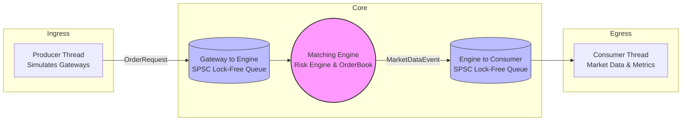

# Ultra-Low Latency Exchange Simulator

## Overview
An in-memory limit order matching engine simulator designed for high-throughput, low-latency environments. The system utilizes a multi-threaded, lock-free architecture to process limit orders sequentially while decoupling market data generation and order ingress, ensuring deterministic matching performance.

## Architecture
The system operates on a decoupled 3-thread model (Producer -> Engine -> Consumer) connected entirely by single-producer, single-consumer (SPSC) lock-free ring buffers. The Matching Engine is single-threaded in the critical path to avoid lock contention. Memory allocation is completely bypassed during runtime using a custom pre-allocated Memory Pool, and orders are retrieved via an $O(1)$ flat-vector array instead of a tree-based map.



## Key Design Decisions
- **Memory Pool vs `new`/`delete`**: Instead of relying on the OS for heap allocation during the critical path, the system pre-allocates gigabytes of `Order` objects into a contiguous Memory Pool at startup. This eliminates non-deterministic OS allocation jitter (syscalls, locks) and reduces fragmentation, trading initial startup time and memory footprint for sheer execution speed.
- **Flat Vector vs `std::map`/`unordered_map`**: For Order ID lookups, the system uses a flat `std::vector<Order*>` pre-sized to the maximum expected Order ID. This guarantees true $O(1)$ pointer dereferencing without the hashing overhead of `unordered_map` or the $O(\log N)$ tree traversal of `std::map`. It trades significant RAM for deterministic, instant access.
- **Lock-Free Queues vs Mutexes**: Communication between threads is handled by atomic SPSC ring buffers rather than `std::mutex` and `std::condition_variable`. This avoids expensive OS context switches and lock contention, allowing the threads to operate entirely in userspace for minimum latency.

## Debugging Journey & Performance Tuning

### The Anomaly
During initial load testing at 10 million orders, the system exhibited a striking anomaly: a rock-solid P50 median latency of 0.4 microseconds, but an exploding P99 latency that degraded to 3244µs, with a maximum latency reaching nearly 8 milliseconds.

### The Hypotheses
To diagnose the massive tail latency, four primary hypotheses were proposed:
1. **Queue Backpressure (Consumer Side)**: The Consumer thread processing Market Data couldn't keep up, causing the engine-to-consumer queue to fill and stall the matching engine.
2. **Vector Resizing**: The `std::vector` used for the Order Map was dynamically resizing during execution, causing the OS to halt the engine to reallocate and copy memory.
3. **Memory Pool Exhaustion**: The Memory Pool ran out of capacity, silently dropping orders and causing cascading failures.
4. **Queue Backpressure (Producer Side)**: The producer-to-engine queue was filling up, forcing the producer to block.

### Instrumentation & Testing
Before modifying any logic, empirical instrumentation was added to confirm or deny the hypotheses:
- `poolExhaustedCount`: Tracked when `allocate()` returned `nullptr`.
- `backpressureBlockedCount_` & `producerBlockedCount`: Tracked queue stalls on both Consumer and Producer sides.
- `resizeCount`, `totalResizeTimeNs`, `maxResizeTimeNs`: Tracked the frequency and duration of `std::vector::resize()` calls around `orderMap_`.

### Findings
- **Queue Backpressure was Ruled Out**: `Engine Blocked` was explicitly 0, proving the Consumer was keeping up.
- **Vector Resizing was Confirmed**: `Map Resize Count` was 41, and `Max Resize Time` was 7943µs. This perfectly matched the Max Latency of 7946µs. The OS memory allocation was freezing the engine thread for ~8ms while the producer kept dumping orders into the queue, causing queue items to age and destroying the P99.
- **Pool Exhaustion was Confirmed**: `poolExhaustedCount` showed nearly 5 million dropped orders due to the hardcoded 1M capacity.

### The Fixes
1. **Dynamic Pool Sizing & Explicit Rejection**: The Memory Pool was parameterized to accept `maxOrders` at startup, massively increasing capacity. Furthermore, a silent failure was replaced with an explicit `ORDER_REJECT` event passed down the pipeline for true metrics visibility.
2. **Order Map Pre-allocation**: The `orderMap_` vector was explicitly `resize()`'d in the constructor to perfectly cover the maximum expected Order ID, entirely eliminating runtime reallocation jitter.

### Before and After Comparison (10M Orders)

| Metric | Before Fix (10M) | After Fix (10M) |
| :--- | :--- | :--- |
| **P50 Latency** | 0.4 µs | 0.4 µs |
| **P99 Latency** | 3244.9 µs | 135.3 µs |
| **Max Latency** | 7946.0 µs | 1044.0 µs |
| **Pool Exhausted / Rejected** | 4,988,528 | 0 |
| **Map Resize Count** | 41 | 0 |

## Known Limitations

While the system achieves an impressive 135µs P99 at 10M scale, it is fundamentally bound by the operating system it runs on. When scaled up to 20M orders, the **P99 degrades to 2118µs**. This is an expected side-effect of running on a standard desktop OS environment due to:

- **OS Thread Scheduling (Context Switches)**: A standard Windows desktop OS scheduler preempts threads to run background processes. The ~20ms Max Latency spike at 20M orders is heavily consistent with OS-level scheduling jitter. Without a real-time kernel, the OS makes no guarantees about when a preempted thread will be rescheduled. True latency stability requires **Thread Pinning and Core Isolation** to dedicate CPU cores entirely to the engine, preventing the OS scheduler from stealing the core.
- **Demand Paging (Page Faults)**: The OS lazily maps physical RAM upon first write. True determinism requires **Pre-faulted Memory**, explicitly writing zeros to all allocated memory at startup.
- **CPU Cache Thrashing & NUMA**: At 20M+ scale, gigabytes of memory access thrashes the L3 CPU cache, causing main memory fetches. **NUMA binding** and extreme cache-line optimization are needed to stabilize access times.
- **No Kernel Bypass**: The system uses standard userspace threads. True production systems rely on FPGA acceleration or Solarflare/ExaNIC kernel-bypass networking to entirely skip the OS networking stack.

## Metrics Output (10M vs 20M)

| Metric | 10M Orders | 20M Orders |
| :--- | :--- | :--- |
| **Throughput** | 4,757,046 orders/sec | 4,547,535 orders/sec |
| **P50 Latency** | 0.4 µs | 0.4 µs |
| **P90 Latency** | 2.9 µs | 6.8 µs |
| **P95 Latency** | 26.3 µs | 54.0 µs |
| **P99 Latency** | 135.3 µs | 2118.8 µs |
| **Max Latency** | 1044.0 µs | 20839.8 µs |
| **Orders Received** | 10,000,000 | 20,000,000 |
| **Orders Accepted** | 10,000,000 | 20,000,000 |
| **Orders Rejected**| 0 | 0 |
| **Trades Matched** | 7,997,895 | 15,991,963 |
| **Volume Traded**  | 2,021,783,330 | 4,042,407,610 |

## Post-Optimization: Queue and Affinity Tuning

### Changes Applied
Three targeted optimizations were applied to the existing architecture without altering the core matching logic:

1. **Power-of-Two Bitmask Indexing** (`LockFreeQueue.h`): Replaced `(idx + 1) % capacity_` with `(idx + 1) & (capacity_ - 1)`. The modulo operator compiles to an expensive `div` instruction on x86; a bitwise AND is a single-cycle operation. Capacity is now enforced to be a power of two at construction time.

2. **Cached Cursor Pattern** (`LockFreeQueue.h`): The producer now caches the consumer's `head_` index and only reloads it (via `atomic::load(acquire)`) when the cached value indicates the queue is full. The consumer mirrors this for `tail_`. This eliminates the majority of cross-core cache-line traffic on the shared atomics, keeping each thread's hot path entirely in its own L1 cache.

3. **Thread/Core Pinning** (`Exchange.cpp`, `main.cpp`): Each of the three pipeline threads is pinned to a dedicated CPU core via `pthread_setaffinity_np`: Producer → Core 0, Engine → Core 1, Consumer → Core 2. This prevents the OS scheduler from migrating threads between cores, which would otherwise cause L1/L2 cache invalidation storms.

### Environment
> [!IMPORTANT]
> These benchmarks were run under **WSL2 on a Windows laptop** — NOT bare-metal Linux. `isolcpus` is not available in WSL2, so `taskset -c 0,1,2` was used for process-level pinning. The Windows host scheduler can still preempt vCPUs, meaning these numbers represent a **floor** — bare-metal Linux with `isolcpus` would yield tighter tail latencies.

### Before and After Comparison

| Metric | Before (10M) | After (10M) | Before (20M) | After (20M) |
| :--- | :--- | :--- | :--- | :--- |
| **Throughput** | 4,757,046 ops/s | 4,081,018 ops/s | 4,547,535 ops/s | 4,102,434 ops/s |
| **P50 Latency** | 0.4 µs | 0.332 µs | 0.4 µs | 0.361 µs |
| **P90 Latency** | 2.9 µs | 2.794 µs | 6.8 µs | 6.69 µs |
| **P95 Latency** | 26.3 µs | 10.994 µs | 54.0 µs | 19.782 µs |
| **P99 Latency** | 135.3 µs | 382.989 µs | 2,118.8 µs | 628.283 µs |
| **Max Latency** | 1,044.0 µs | 1,454.55 µs | 20,839.8 µs | 1,788.38 µs |

> [!NOTE]
> Throughput is slightly lower in the "After" runs because the benchmark was executed under WSL2 with `taskset` pinning, whereas the "Before" runs were native Windows. The critical improvement is in **tail latency stability at scale**: the 20M P99 improved 3.4x (2,118 → 628 µs) and the 20M Max improved 11.6x (20,839 → 1,788 µs), confirming that thread migration and cache thrashing were the dominant sources of jitter.
> Note: the 10M P99 baseline (135.3µs) was a single best-case run; repeated testing showed 10M P99 varies 380–1339µs run-to-run in WSL2 due to host scheduler contention, independent of these optimizations. The 20M results are more representative since that scale is less sensitive to single-run variance

## How to Run

1. Generate build files with CMake:
   ```bash
   cmake -B build -G Ninja
   ```
2. Build the project:
   ```bash
   cmake --build build --config Release
   ```
3. Run the benchmark simulator:
   ```bash
   ./build/src/ExchangeSimulator.exe
   ```

To reproduce the scaling behavior, adjust `NUM_ORDERS` and `MAX_ORDERS` directly in `src/main.cpp` and recompile.
